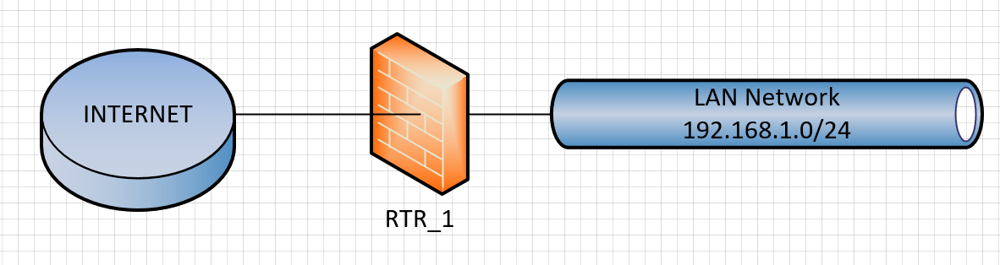

# Setup
First clear the entire routerboard and then connect a ethernet cable to the last ethernetport. 
Then either add the config via the terminal or upload the backup file and restore that.  

## Overview

**Do not forget to set the admin password**

## WAN
The first interface is seen as the WAN Interface. 
There is a bridge and the firewall rules are on the bridge. 
There is also a source nat with a masquerade rule on the brige for internet access.

## LAN
The ethernet interfaces remaining on the routerboard are in a bridge for the LAN. 
A dhcp server for LAN clients runs on the LAN Bridge.